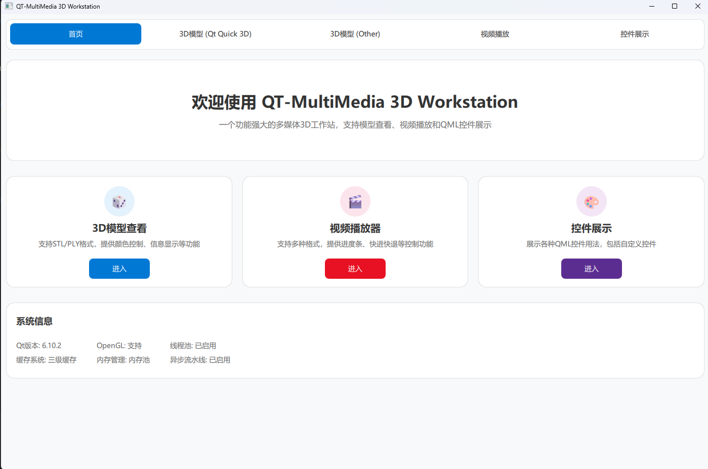
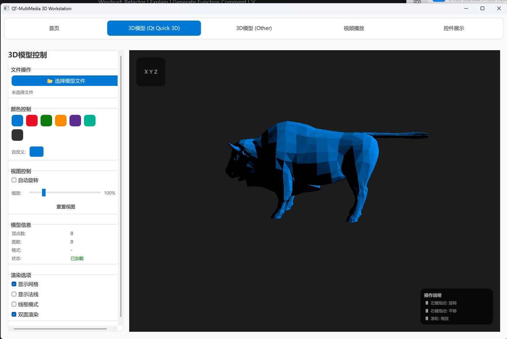
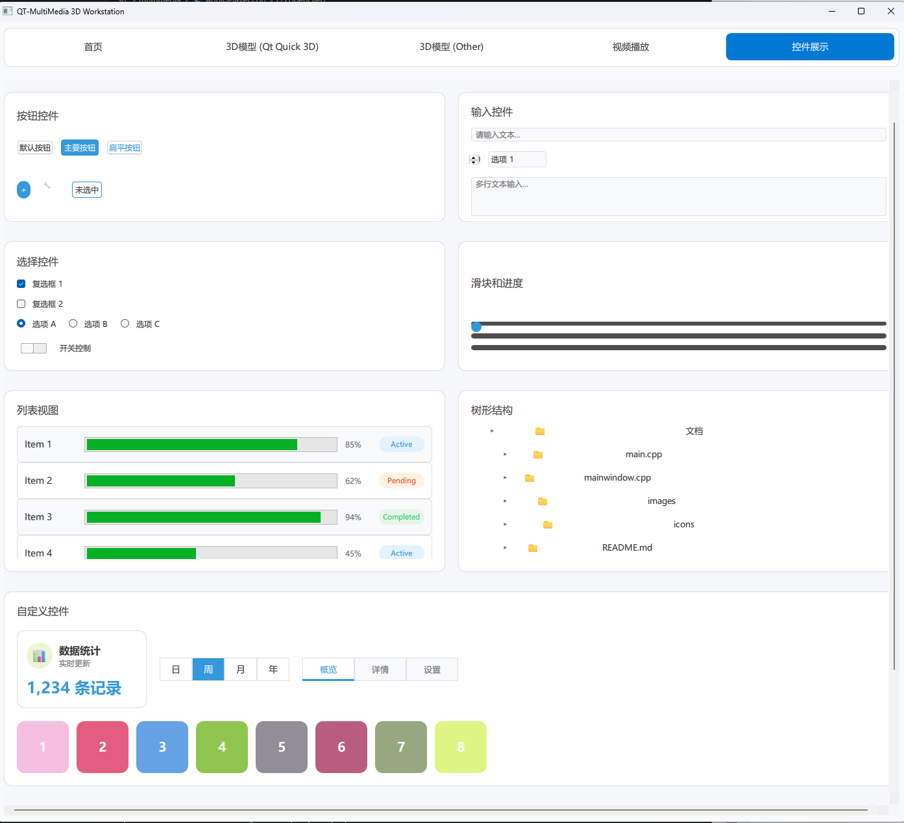

# QT-MultiMedia 3D Workstation

## 项目概述

QT-MultiMedia 3D Workstation 是一个基于 Qt 框架的多媒体和 3D 模型查看器应用，提供了丰富的功能和直观的用户界面。该项目集成了两种不同的 3D 渲染引擎实现，旨在展示不同技术栈的优势和应用场景。

## 功能特点

### 核心功能
- **3D 模型查看**：支持 STL、PLY、OBJ、glTF/glb 等格式的 3D 模型加载和显示
- **双渲染引擎**：
  - Qt Quick 3D 版本：使用 Qt 内置的 Quick 3D 模块，提供高级渲染功能
  - OpenGL 版本：使用原生 OpenGL，提供底层控制和高性能渲染
- **视频播放**：支持各种视频格式的播放和控制
- **图像处理**：基本的图像编辑和处理功能
- **控件展示**：展示各种 Qt 控件的使用方法

### 3D 模型查看器特性
- **模型加载**：支持多种 3D 模型格式，使用 Assimp 库进行统一解析
- **视图控制**：
  - 左键拖动：模型旋转（四元数实现，避免万向节锁）
  - 右键拖动：模型平移
  - 滚轮：模型缩放
  - 快捷键：R 重置视图，F 适配模型
- **渲染模式**：实体渲染、线框模式、点云模式、实体+线框组合
- **材质和光照**：基础颜色调整、金属度/粗糙度控制、环境光和平行光设置
- **模型信息**：顶点数/面数统计、包围盒尺寸、文件格式和大小
- **其他功能**：自动旋转、坐标系显示、网格地面

## 技术栈

### 核心技术
- **Qt 6**：跨平台应用框架
- **Qt Quick 3D**：高级 3D 渲染框架
- **OpenGL**：底层图形渲染 API
- **Assimp**：3D 模型导入库
- **C++17**：核心编程语言
- **QML**：用户界面描述语言

### 依赖库
- **Qt 6.0+**：Core, GUI, Quick, Quick3D, Widgets, OpenGL
- **Assimp 5.0+**：3D 模型导入库

## 项目结构

```
QT-MultiMedia-3D-Workstation/
├── src/
│   ├── 3d/                  # 3D 模型加载器
│   │   ├── CMakeLists.txt
│   │   ├── ModelLoader.cpp
│   │   └── ModelLoader.h
│   ├── imageprocessing/     # 图像处理模块
│   │   ├── CMakeLists.txt
│   │   ├── ImageProcessor.cpp
│   │   └── ImageProcessor.h
│   ├── memory/              # 内存管理模块
│   │   ├── CMakeLists.txt
│   │   ├── MemoryPool.cpp
│   │   ├── MemoryPool.h
│   │   ├── RingBuffer.cpp
│   │   └── RingBuffer.h
│   ├── multimedia/          # 多媒体处理模块
│   │   ├── AudioPlayer.cpp
│   │   ├── AudioPlayer.h
│   │   ├── CMakeLists.txt
│   │   ├── VideoPlayer.cpp
│   │   └── VideoPlayer.h
│   ├── opengl-viewer/       # OpenGL 版本的 3D 查看器
│   │   ├── shaders/         # 着色器文件
│   │   │   ├── point.frag
│   │   │   ├── point.vert
│   │   │   ├── solid.frag
│   │   │   ├── solid.vert
│   │   │   ├── wireframe.frag
│   │   │   └── wireframe.vert
│   │   ├── CMakeLists.txt
│   │   ├── GLCamera.cpp
│   │   ├── GLCamera.h
│   │   ├── GLModel.cpp
│   │   ├── GLModel.h
│   │   ├── GLRenderer.cpp
│   │   ├── GLRenderer.h
│   │   ├── GLWidget.cpp
│   │   ├── GLWidget.h
│   │   └── main.cpp
│   ├── qml/                 # QML 界面文件
│   │   ├── ControlsPage.qml
│   │   ├── HomePage.qml
│   │   ├── MainWindow.qml
│   │   ├── ModelTestPage.qml
│   │   ├── ModelViewerOpenglPage.qml
│   │   ├── ModelViewerPage.qml
│   │   ├── VideoPlayerPage.qml
│   │   └── main.qml
│   ├── qtquick3d-viewer/    # Qt Quick 3D 版本的 3D 查看器
│   │   ├── CMakeLists.txt
│   │   ├── ControlPanel.qml
│   │   ├── ModelLoader.cpp
│   │   ├── ModelLoader.h
│   │   ├── ModelViewer3D.qml
│   │   └── main.qml
│   ├── thread/              # 线程管理模块
│   │   ├── CMakeLists.txt
│   │   ├── Task.cpp
│   │   ├── Task.h
│   │   ├── ThreadPool.cpp
│   │   └── ThreadPool.h
│   ├── CMakeLists.txt
│   ├── main.cpp
│   └── qml.qrc
├── CMakeLists.txt
└── README.md
```

## 代码架构

### 3D 模型加载器
- **ModelLoader**：核心模型加载类，使用 Assimp 库加载和解析 3D 模型文件，支持多种格式
- **GLModel**：OpenGL 版本的模型数据管理，负责 VAO/VBO/EBO 的创建和管理

### 渲染引擎
- **Qt Quick 3D 版本**：
  - 使用 QQuick3DGeometry 自定义几何
  - 四元数相机控制器
  - 信号槽连接 C++ 与 QML
  - 原生支持鼠标交互
- **OpenGL 版本**：
  - 现代 OpenGL (3.3+ 核心模式)
  - VAO/VBO/EBO 管理
  - GLSL 着色器程序
  - 四元数相机系统
  - 手动实现鼠标交互

### 界面架构
- **MainWindow.qml**：主窗口，包含标签页和内容区域
- **ModelViewerPage.qml**：Qt Quick 3D 版本的 3D 模型查看器页面
- **ModelViewerOpenglPage.qml**：OpenGL 版本的 3D 模型查看器页面
- **VideoPlayerPage.qml**：视频播放器页面
- **ControlsPage.qml**：控件展示页面
- **HomePage.qml**：首页

### 模块架构
- **核心模块**：3D 模型加载器、图像处理、内存管理、多媒体处理、线程管理
- **渲染模块**：Qt Quick 3D 渲染器、OpenGL 渲染器
- **界面模块**：QML 界面组件

## 安装和构建

### 前提条件
- **Qt 6.0+**：安装 Qt 6.0 或更高版本，确保包含以下组件：
  - Qt Core
  - Qt GUI
  - Qt Quick
  - Qt Quick3D
  - Qt Widgets
  - Qt OpenGL
- **Assimp 5.0+**：3D 模型导入库，可以通过 vcpkg 或源码编译安装
  - vcpkg 安装：`vcpkg install assimp:x64-windows`
- **CMake 3.16+**：构建系统

### 构建步骤
1. **克隆仓库**：
   ```bash
   git clone https://github.com/yourusername/QT-MultiMedia-3D-Workstation.git
   cd QT-MultiMedia-3D-Workstation
   ```

2. **配置 CMake**：
   ```bash
   mkdir build
   cd build
   cmake .. -DCMAKE_TOOLCHAIN_FILE=<path-to-vcpkg>/scripts/buildsystems/vcpkg.cmake
   ```

3. **构建项目**：
   ```bash
   cmake --build . --config Release
   ```

4. **运行应用**：
   ```bash
   ./src/QT-MultiMedia-3D-Workstation.exe
   ```

## 使用方法

### 3D 模型查看
1. **选择渲染引擎**：在主窗口的标签页中选择 "3D模型 (Qt Quick 3D)" 或 "3D模型 (OpenGL)"
2. **加载模型**：点击 "选择模型文件" 按钮，选择一个 3D 模型文件
3. **控制视图**：
   - 左键拖动：旋转模型
   - 右键拖动：平移模型
   - 滚轮：缩放模型
   - R 键：重置视图
   - F 键：适配模型到视图
4. **调整参数**：
   - 颜色控制：选择预设颜色或自定义颜色
   - 视图控制：调整缩放、开启自动旋转
   - 渲染选项：显示网格、显示法线、线框模式等

### 视频播放
1. **选择视频**：点击 "选择视频文件" 按钮，选择一个视频文件
2. **控制播放**：使用播放/暂停、快进/快退等控制按钮
3. **调整参数**：调整音量、亮度、对比度等参数

### 图像处理
1. **选择图像**：点击 "选择图像文件" 按钮，选择一个图像文件
2. **应用滤镜**：选择并应用各种图像滤镜
3. **调整参数**：调整亮度、对比度、饱和度等参数
4. **保存结果**：点击 "保存" 按钮保存处理后的图像

## 开发指南

### 代码风格
- **C++**：遵循 Qt 代码风格，使用 4 空格缩进
- **QML**：遵循 Qt Quick 代码风格，使用 4 空格缩进
- **命名规范**：
  - 类名：PascalCase
  - 函数名：camelCase
  - 变量名：camelCase
  - 常量名：ALL_CAPS

### 扩展功能
1. **添加新的 3D 模型格式支持**：
   - 在 `ModelLoader` 类中添加对新格式的支持
   - 确保 Assimp 库支持该格式

2. **添加新的渲染模式**：
   - Qt Quick 3D 版本：添加新的材质和渲染设置
   - OpenGL 版本：添加新的着色器程序

3. **添加新的图像处理滤镜**：
   - 在 `ImageProcessor` 类中添加新的滤镜实现
   - 在界面中添加对应的控制选项

## 贡献指南

1. **Fork 仓库**
2. **创建分支**：`git checkout -b feature/your-feature`
3. **提交更改**：`git commit -m "Add your feature"`
4. **推送到分支**：`git push origin feature/your-feature`
5. **创建 Pull Request**

## 许可证

本项目采用 MIT 许可证，详情请参阅 LICENSE 文件。

## 致谢

- **Qt**：提供了强大的跨平台应用框架
- **Assimp**：提供了全面的 3D 模型导入功能
- **OpenGL**：提供了底层图形渲染能力

## 联系方式

- **项目地址**：https://github.com/yourusername/QT-MultiMedia-3D-Workstation
- **作者**：Your Name
- **邮箱**：your.email@example.com

---

*QT-MultiMedia 3D Workstation - 一个功能强大的多媒体和 3D 模型查看器应用*

# 软件展示




